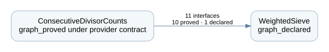

# Erdős Problem 946 — Lean Formalization Workspace

A Lean 4 workspace for infinitely many consecutive natural numbers with the same number of divisors:

```lean
{n : ℕ | σ 0 n = σ 0 (n + 1)}.Infinite
```

The consumer has completed its `graph_proved` contract under a fixed `graph_declared` WeightedSieve provider. **The external quantitative almost-prime theorem remains declared**, so the final theorem still depends on that sieve assumption (`sorryAx`). This publication is not a fully discharged end-to-end proof.



## Repositories and fixed versions

| Repository | Completion | Public export commit |
| --- | --- | --- |
| [ConsecutiveDivisorCounts](https://github.com/iiis-lean/consecutive-divisor-counts) | `graph_proved` | [`6e4403a9a5fb`](https://github.com/iiis-lean/consecutive-divisor-counts/tree/6e4403a9a5fb212e6f24998ab1e0d7a2ff80d9cf) |
| [WeightedSieve](https://github.com/iiis-lean/weighted-sieve) | `graph_declared` | [`b2e4c77ce10c`](https://github.com/iiis-lean/weighted-sieve/tree/b2e4c77ce10c3b6204a43182aa1e0118c9c83085) |

The gitlinks and the consumer's Lake dependency select these exact public commits. [workspace.json](workspace.json) also records the corresponding local LC Releases. Public export commits differ from local development Release commits because copyrighted full-text source transcriptions, private runtime state and development history are excluded. Every owned Lean file is byte-identical to its canonical source; each child contains a `publication-export.json` receipt.

## Build

```sh
git clone --recurse-submodules https://github.com/iiis-lean/erdos-946.git
cd erdos-946/repos/ConsecutiveDivisorCounts
lake build
```

Lean is fixed to **4.32.0**. Lake downloads the public provider at its pinned commit and the locked Mathlib dependencies. Each child can also be cloned and built independently.

## Formalization size

| Metric | Consumer | Provider | Total |
| --- | ---: | ---: | ---: |
| Current declarations | 56 | 28 | 84 |
| Theorems in proved state | 48 | 0 | 48 |
| Content-public declarations | 13 | 26 | 39 |
| Private declarations | 43 | 2 | 45 |
| Owned Lean files | 66 | 54 | 120 |
| Physical Lean lines | 12,543 | 809 | 13,352 |
| Code lines | 10,973 | 349 | 11,322 |

The provider has nine declared theorems, 17 definitions and two structures. The consumer has 48 proved theorems and eight definitions. It uses 11 provider interfaces through 84 Statement/Proof uses: ten definition/structure interfaces with proved availability and one declared theorem. See [STATISTICS.md](STATISTICS.md) for counting rules and the machine-readable report.

## Read the proof and interfaces

- **ConsecutiveDivisorCounts**: [Main API](https://github.com/iiis-lean/consecutive-divisor-counts/blob/6e4403a9a5fb212e6f24998ab1e0d7a2ff80d9cf/docs/lean-constellation/PUBLIC_API.md), [public boundaries](https://github.com/iiis-lean/consecutive-divisor-counts/blob/6e4403a9a5fb212e6f24998ab1e0d7a2ff80d9cf/docs/lean-constellation/PUBLIC_BOUNDARIES.md), [complete graph](https://github.com/iiis-lean/consecutive-divisor-counts/blob/6e4403a9a5fb212e6f24998ab1e0d7a2ff80d9cf/docs/lean-constellation/DECLARATION_GRAPH.md), [external interfaces](https://github.com/iiis-lean/consecutive-divisor-counts/blob/6e4403a9a5fb212e6f24998ab1e0d7a2ff80d9cf/docs/lean-constellation/EXTERNAL_DEPENDENCIES.md).
- **WeightedSieve**: [Main API](https://github.com/iiis-lean/weighted-sieve/blob/b2e4c77ce10c3b6204a43182aa1e0118c9c83085/docs/lean-constellation/PUBLIC_API.md), [public boundaries](https://github.com/iiis-lean/weighted-sieve/blob/b2e4c77ce10c3b6204a43182aa1e0118c9c83085/docs/lean-constellation/PUBLIC_BOUNDARIES.md), [complete graph](https://github.com/iiis-lean/weighted-sieve/blob/b2e4c77ce10c3b6204a43182aa1e0118c9c83085/docs/lean-constellation/DECLARATION_GRAPH.md), [external interfaces](https://github.com/iiis-lean/weighted-sieve/blob/b2e4c77ce10c3b6204a43182aa1e0118c9c83085/docs/lean-constellation/EXTERNAL_DEPENDENCIES.md).

## Citation and licensing

The original theorem is due to D. R. Heath-Brown, *The divisor function at consecutive integers*, Mathematika **31**(1) (1984), 141–149, [doi:10.1112/S0025579300010743](https://doi.org/10.1112/S0025579300010743). The provider interface draws on Heini Halberstam and Hans-Egon Richert, *Sieve Methods* (Academic Press, 1974), and Shenggang Xie, “On the (k)-Twin Primes Problem,” Acta Mathematica Sinica **26**(3) (1983), 378–384.

The Lean implementation was produced independently by IIIS Lean using [Lean Constellation](https://github.com/iiis-lean/lean-constellation). Cite both the mathematical sources and this implementation; see [CITATION.cff](CITATION.cff).

Original code and documentation are licensed under [Apache-2.0](LICENSE). [NOTICE](NOTICE) records attribution and exclusions; the cited books and papers are not relicensed or reproduced here. Lean and Mathlib retain their own upstream licenses.
